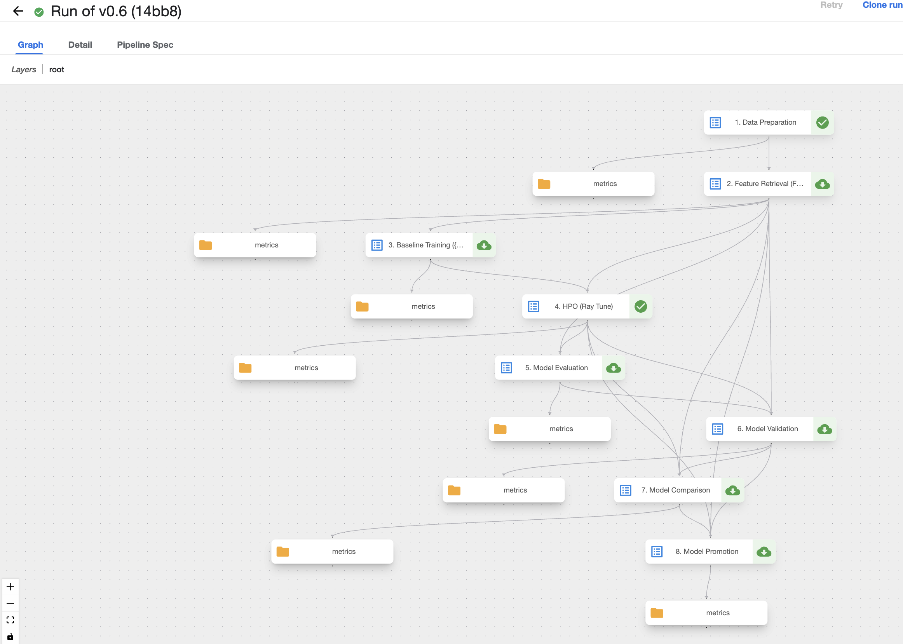
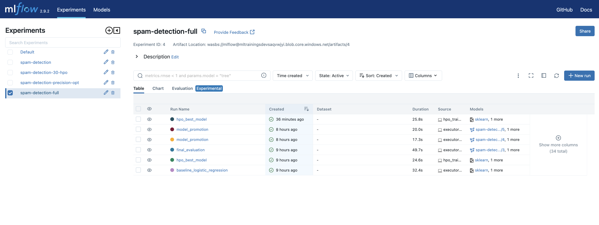
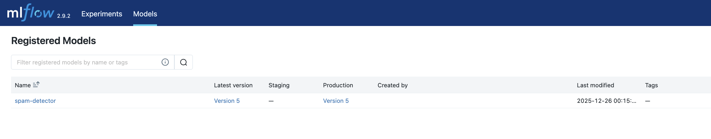
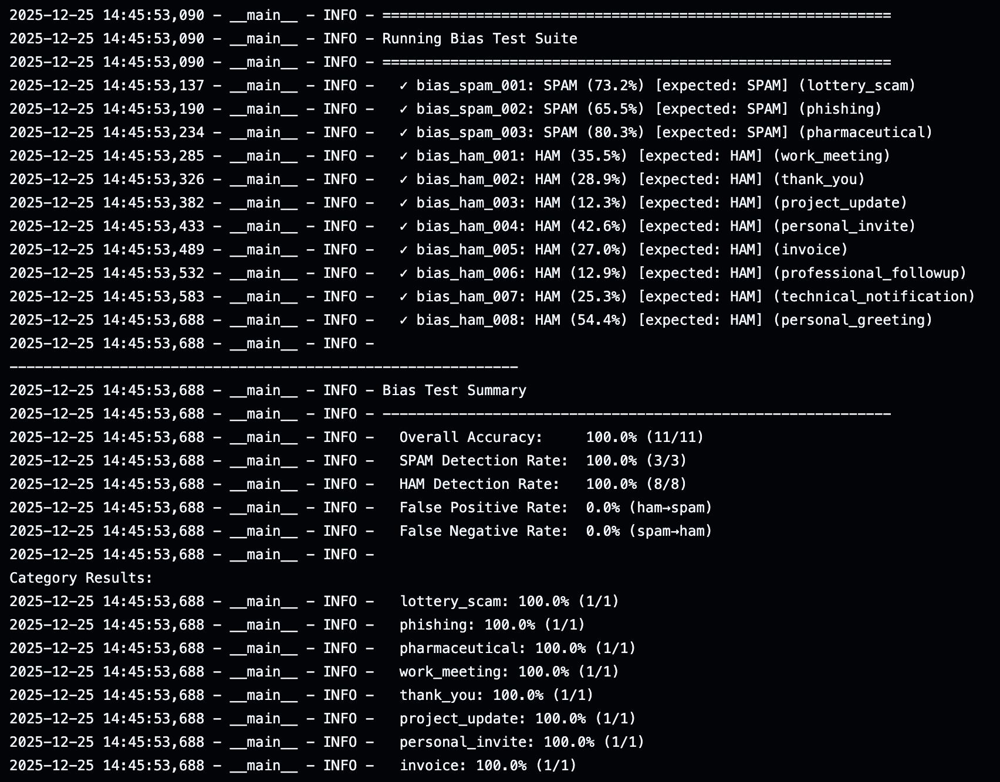

# ML Model Lifecycle Management Platform

A production-grade MLOps platform for spam detection, demonstrating end-to-end machine learning lifecycle management on Azure Kubernetes Service.

## 📸 Screenshots

| Kubeflow Training Pipeline | MLflow Experiments |
|:--------------------------:|:------------------:|
|  |  |

| MLflow Model Registry | Integration Tests |
|:---------------------:|:-----------------:|
|  |  |

## 🎯 Overview

### Problem Statement
**Email Spam Detection** - Classify emails as spam or legitimate (ham) in real-time to protect users from unwanted/malicious content.

### Model
- **Algorithm**: XGBoost classifier with hyperparameter optimization via Ray Tune
- **Features**: 524 engineered features including TF-IDF text features, email metadata, and structural features
- **Export**: Trained model is converted to ONNX format for high-performance inference on Triton

### Dataset
- **Source**: [SpamAssassin Public Corpus](https://spamassassin.apache.org/old/publiccorpus/)
- **Size**: ~6,000 labeled emails (spam + ham)
- **Format**: Raw email files processed into structured Parquet format

### Platform Overview
This platform provides automated model training, multi-environment deployment, real-time and batch inference, and continuous monitoring with drift detection.

```
┌─────────────────────────────────────────────────────────────────────────────────────────┐
│                              ML LIFECYCLE MANAGEMENT PLATFORM                            │
├─────────────────────────────────────────────────────────────────────────────────────────┤
│                                                                                          │
│  ┌─────────────┐    ┌─────────────┐    ┌─────────────┐    ┌─────────────┐              │
│  │   Kubeflow  │───▶│    Ray      │───▶│   MLflow    │───▶│   KServe    │              │
│  │  Pipelines  │    │  Training   │    │  Registry   │    │  Serving    │              │
│  └─────────────┘    └─────────────┘    └─────────────┘    └─────────────┘              │
│        │                  │                  │                  │                       │
│        │                  │                  │                  ▼                       │
│        │                  │                  │          ┌─────────────┐                 │
│        │                  │                  │          │ API Gateway │◀── Requests    │
│        │                  │                  │          │  (FastAPI)  │                 │
│        │                  │                  │          └──────┬──────┘                 │
│        │                  │                  │                 │                        │
│        ▼                  ▼                  ▼                 ▼                        │
│  ┌──────────────────────────────────────────────────────────────────────────────────┐  │
│  │                           Azure Blob Storage                                      │  │
│  │   training-data/  │  models/  │  baselines/  │  inference-logs/  │  drift-reports/│  │
│  └──────────────────────────────────────────────────────────────────────────────────┘  │
│                                          │                                              │
│                                          ▼                                              │
│                                 ┌─────────────────┐                                     │
│                                 │ Drift Detection │                                     │
│                                 │    (CronJob)    │                                     │
│                                 └─────────────────┘                                     │
│                                                                                          │
└─────────────────────────────────────────────────────────────────────────────────────────┘
```

## ✨ Features

| Category | Feature | Implementation |
|----------|---------|----------------|
| **Training** | Automated pipelines | Kubeflow Pipelines |
| | Distributed training | Ray |
| | Experiment tracking | MLflow |
| **Deployment** | Multi-environment | KServe (staging/production) |
| | Feature serving | Feast + Redis |
| | Real-time inference | FastAPI API Gateway |
| | Batch inference | Ray Jobs |
| **Monitoring** | Drift detection | PSI/KS tests + Evidently |
| | Inference logging | Azure Blob (Parquet) |
| | Alerting | Webhook + structured logs |
| **Infrastructure** | Container orchestration | AKS (Kubernetes) |
| | Service mesh | Istio |
| | IaC | Terraform |

## 🏗️ Architecture

### Components

| Component | Technology | Purpose |
|-----------|------------|---------|
| `training/` | Kubeflow + Ray + MLflow | Model training pipeline |
| `model-serving/` | KServe + FastAPI | Inference services |
| `monitoring/` | Custom + Evidently | Drift detection |
| `data-pipeline/` | Ray Jobs | Data preprocessing |
| `terraform/` | Terraform | Infrastructure as Code |

### Kubernetes Namespaces

```
kubeflow    - Training pipelines
mlflow      - Experiment tracking & model registry
ray         - Distributed computing
kserve      - Model serving (staging + production)
serving     - API gateway & feature transformer
monitoring  - Drift detection jobs
```

## 🚀 Quick Start

### Prerequisites

- Azure subscription
- Azure CLI (`az`)
- Terraform
- kubectl
- Docker

### 1. Deploy Infrastructure

```bash
# Base infrastructure (AKS, ACR, Storage)
cd terraform/base-infra
terraform init && terraform apply

# ML platform (Kubeflow, MLflow, Ray, KServe)
cd ../ml-platform
terraform init && terraform apply
```

### 2. Run Training Pipeline

Train the spam detection model using Kubeflow Pipelines:

```bash
cd training
make build-images
make compile-pipeline
```

**Kubeflow UI**
1. Port-forward to Kubeflow: `kubectl port-forward svc/ml-pipeline-ui -n kubeflow 8080:80`
2. Open http://localhost:8080 in your browser
3. Navigate to **Pipelines** → Upload the pipeline YAML from `training/pipeline/`
4. Create a **Run** with desired parameters (dataset path, hyperparameters)
5. Monitor execution in the UI - each step shows logs and artifacts

The pipeline will: download data → extract features → train model → register in MLflow.

### 3. Build & Deploy Serving Components

Build and deploy the model serving infrastructure:

**Option A: Via GitHub Actions (Recommended for CI/CD)**
```bash
cd model-serving
make infra
# Trigger the workflow manually
model-serving.yaml
```

**Option B: Via Make (Local Development)**
```bash
cd model-serving
make setup      # Deploy all components
```

### 4. Test Inference

```bash
# Get the Istio ingress gateway public IP
export GATEWAY_IP=$(kubectl get svc istio-ingressgateway -n istio-system -o jsonpath='{.status.loadBalancer.ingress[0].ip}')

# Test prediction (staging - default)
curl -X POST http://$GATEWAY_IP/predict \
  -H "Host: api.ml-platform.example.com" \
  -H "Content-Type: application/json" \
  -H "X-API-Key: test-operator-key" \
  -d '{"email_id": "1", "subject": "Win $1000!", "body": "Click here now", "sender": "promo@test.com"}'

# Test prediction (production)
curl -X POST http://$GATEWAY_IP/predict \
  -H "Host: api.ml-platform.example.com" \
  -H "Content-Type: application/json" \
  -H "X-API-Key: test-operator-key" \
  -H "X-Environment: production" \
  -d '{"email_id": "1", "subject": "Meeting tomorrow", "body": "Hi, can we meet?", "sender": "colleague@company.com"}'
```

**Alternative: Port-forward (for local debugging)**
```bash
kubectl port-forward svc/api-gateway -n serving 8000:80
curl -X POST http://localhost:8000/predict ...
```

### 5. Monitor Drift

```bash
cd monitoring
make trigger-job    # Manual drift check
make view-metrics   # View results
```

## 📁 Project Structure

```
spam_detection/
├── README.md                 # This file
├── terraform/
│   ├── base-infra/          # AKS, ACR, Storage, Redis
│   └── ml-platform/         # Kubeflow, MLflow, Ray, KServe
├── training/
│   ├── pipeline/            # Kubeflow pipeline definition
│   └── docker/              # Training container images
├── model-serving/
│   ├── api-gateway/         # FastAPI inference API
│   ├── feature-transformer/ # Feature extraction service
│   ├── inference-service/   # KServe model deployments
│   ├── batch-inference/     # Ray batch processing
│   └── feast/               # Feature store config
├── monitoring/
│   ├── baseline/            # Baseline generation
│   ├── drift_detector/      # Drift detection logic
│   └── tests/               # Unit tests
├── data-pipeline/           # Data preprocessing jobs
└── scripts/                 # Utility scripts
```

## 🔑 Key Design Decisions

### 1. Multi-Environment Deployment
- **Staging**: Lower resources, scale-to-zero, for testing
- **Production**: Higher resources, min 2 replicas, HA
- Switch via `X-Environment` header

### 2. Scalability
- HPA on all components (2-10 replicas)
- Ray for distributed training/batch
- Async inference logging

### 3. Monitoring Strategy
- **Baseline**: Generated from training data (PSI histograms)
- **Drift Detection**: Hourly CronJob comparing production vs baseline
- **Metrics**: PSI, KS-test, aggregate drift score

### 4. Security
- API key authentication
- Kubernetes RBAC
- Azure managed identities (where possible)

## 📊 API Endpoints

| Endpoint | Method | Description |
|----------|--------|-------------|
| `/predict` | POST | Single email prediction |
| `/predict/batch-sync` | POST | Sync batch (up to 100 emails) |
| `/predict/batch` | POST | Async batch job (large datasets via Ray) |
| `/predict/batch/{job_id}` | GET | Check batch job status |
| `/health` | GET | Service health check |
| `/ready` | GET | Readiness check |

## 🧪 Testing

```bash
# API Gateway tests
cd model-serving && make test

# Monitoring tests
cd monitoring && make test

# Run demo
./scripts/demo.sh
```

## CI/CD Workflows

The platform includes two main GitHub Actions workflows for automated building, testing, and deployment. Both use self-hosted runners on AKS (via Actions Runner Controller) for direct cluster access.

### 1. Model Serving CI/CD Workflow

Builds, tests, and deploys the model serving infrastructure components (API Gateway, Feature Transformer, etc.)

```
┌─────────────────────────────────────────────────────────────────────────────────┐
│                     Model Serving CI/CD Workflow                                 │
├─────────────────────────────────────────────────────────────────────────────────┤
│                                                                                  │
│  Trigger: Push to main (model-serving/**) or manual dispatch                    │
│                                                                                  │
│  ┌──────────────┐   ┌──────────────┐   ┌──────────────┐   ┌──────────────┐     │
│  │    Build     │──▶│   Deploy     │──▶│ Integration  │──▶│   Deploy     │     │
│  │   Images     │   │   Staging    │   │    Tests     │   │  Production  │     │
│  └──────────────┘   └──────────────┘   └──────────────┘   └──────────────┘     │
│        │                                                          │             │
│        ▼                                                          │             │
│  • api-gateway                                           (requires approval)    │
│  • feature-transformer                                                          │
│  • model-export                                                                 │
│  • batch-inference                                                              │
│                                                                                  │
└─────────────────────────────────────────────────────────────────────────────────┘
```

#### Workflow Steps

| Step | Job Name | Description |
|------|----------|-------------|
| 1 | `build` | Builds and pushes Docker images to ACR |
| 2 | `deploy-staging` | Deploys services to staging environment |
| 3 | `integration-tests` | Runs health checks, inference tests, batch tests |
| 4 | `deploy-production` | Deploys to production (requires approval) |

#### Triggering the Workflow

```bash
# Automatic: Push changes to model-serving/ directory

# Manual via GitHub CLI
gh workflow run model-serving.yaml \
  -f deploy_environment=staging \
  -f image_tag=v1.0.0
```

#### Workflow Inputs

| Input | Required | Default | Description |
|-------|----------|---------|-------------|
| `deploy_environment` | Yes | `staging` | Target environment (staging/production) |
| `image_tag` | No | auto-generated | Docker image tag |

---

### 2. Model Deploy Workflow

Deploys ML models from MLflow to KServe InferenceService.

```
┌─────────────────────────────────────────────────────────────────────────────────┐
│                         Model Deploy Workflow                                    │
├─────────────────────────────────────────────────────────────────────────────────┤
│                                                                                  │
│  Trigger: Manual dispatch (workflow_dispatch)                                   │
│                                                                                  │
│  ┌──────────────┐   ┌──────────────┐   ┌──────────────┐   ┌──────────────┐     │
│  │   Verify     │──▶│    Export    │──▶│   Deploy     │──▶│    Smoke     │     │
│  │   Staging    │   │   to ONNX    │   │   Staging    │   │    Tests     │     │
│  │    Model     │   │              │   │              │   │              │     │
│  └──────────────┘   └──────────────┘   └──────────────┘   └──────────────┘     │
│                                                                    │            │
│                                                                    ▼            │
│                                                           ┌──────────────┐      │
│                                                           │   Promote    │      │
│                                                           │     to       │      │
│                                                           │  Production  │      │
│                                                           └──────────────┘      │
│                                                                    │            │
│                              (Optional - if deploy_to_production)  ▼            │
│                                                           ┌──────────────┐      │
│                                                           │   Deploy     │      │
│                                                           │  Production  │      │
│                                                           └──────────────┘      │
│                                                                                  │
└─────────────────────────────────────────────────────────────────────────────────┘
```

#### Workflow Steps

| Step | Job Name | Description |
|------|----------|-------------|
| 1 | `verify-staging-model` | Verifies model exists in MLflow Staging stage |
| 2 | `export-model` | Exports model to ONNX format, uploads to Azure Blob |
| 3 | `deploy-staging` | Deploys to KServe staging InferenceService |
| 4 | `smoke-tests` | Runs health check and inference tests |
| 5 | `promote-to-production` | Promotes model to Production stage in MLflow |
| 6 | `deploy-production` | (Optional) Deploys to production with approval |

#### Triggering the Workflow

```bash
# Via GitHub UI
# Go to Actions → Model Deploy → Run workflow

# Or via GitHub CLI
gh workflow run model-deploy.yaml \
  -f model_name=spam-detector \
  -f deploy_to_production=false \
  -f image_tag=v0.35
```

#### Workflow Inputs

| Input | Required | Default | Description |
|-------|----------|---------|-------------|
| `model_name` | Yes | `spam-detector` | Model name in MLflow registry |
| `deploy_to_production` | No | `false` | Also deploy to production after staging |
| `image_tag` | No | `v0.35` | Docker image tag for model-export |
| `acr_name` | No | auto-detect | Azure Container Registry name |

---

### Self-Hosted Runners

Both workflows run on self-hosted runners deployed via Actions Runner Controller (ARC):

```yaml
runs-on: ml-platform-runners  # ARC scale set on AKS
```

Runners have:
- Direct access to Kubernetes cluster
- Access to internal services (MLflow, KServe)
- Docker-in-Docker (DinD) for image builds
- Pre-configured Azure credentials via K8s secrets

### Infrastructure

Runners are deployed via Terraform in `terraform/ml-platform/github-runners.tf`:

```hcl
# Runner scale set with min 0, max 3 runners
resource "helm_release" "arc_runner_set" {
  name  = "ml-platform-runners"
  chart = "gha-runner-scale-set"
  # ... configuration
}
```

## 📈 Demo Script

Run the end-to-end demo:

```bash
./scripts/demo.sh
```

This demonstrates:
1. ✅ Service health checks
2. ✅ Staging vs Production inference
3. ✅ Batch predictions
4. ✅ Drift detection
5. ✅ Scalability (HPA status)

## 📚 Documentation

| Document | Description |
|----------|-------------|
| [DESIGN.md](DESIGN.md) | Technology choices & rationale |
| [docs/ARCHITECTURE.md](docs/ARCHITECTURE.md) | Architecture diagrams & flows |
| [training/README.md](training/README.md) | Training pipeline documentation |
| [model-serving/README.md](model-serving/README.md) | Model serving & API documentation |
| [monitoring/README.md](monitoring/README.md) | Drift detection & monitoring |
| [terraform/base-infra/README.md](terraform/base-infra/README.md) | Infrastructure setup |

## 🛠️ Technologies

- **Cloud**: Azure (AKS, ACR, Blob Storage, Redis)
- **ML Model**: XGBoost (with Ray Tune HPO), exported to ONNX
- **ML Libraries**: scikit-learn, xgboost, onnxmltools
- **Orchestration**: Kubernetes, Kubeflow, Ray
- **Serving**: KServe, Triton Inference Server, FastAPI
- **Feature Store**: Feast + Redis
- **Monitoring**: Custom drift detection, Evidently
- **IaC**: Terraform
- **Service Mesh**: Istio

## 📝 License

MIT
